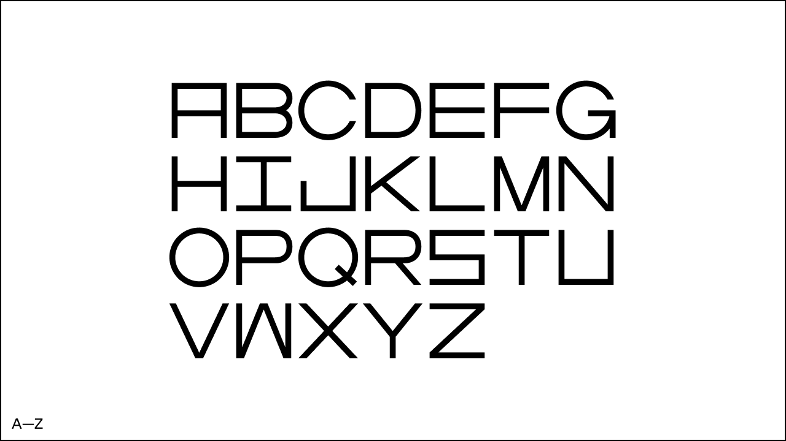
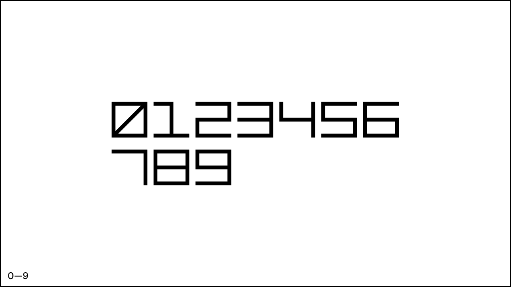
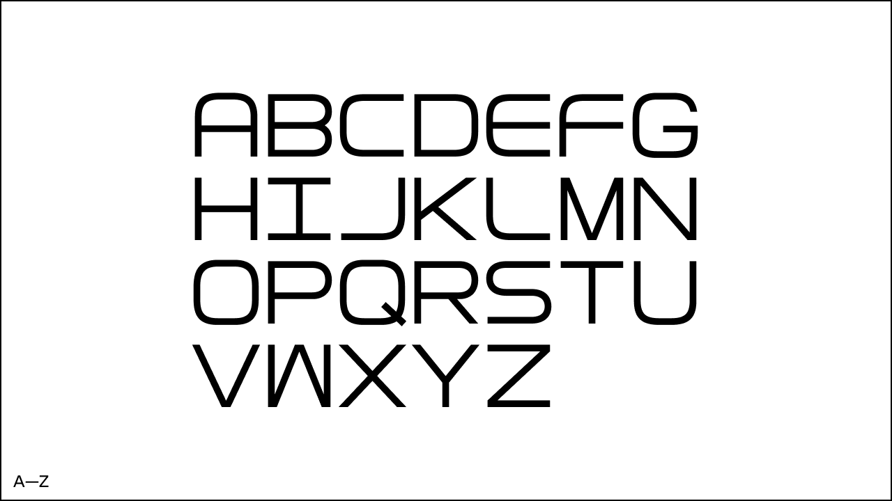
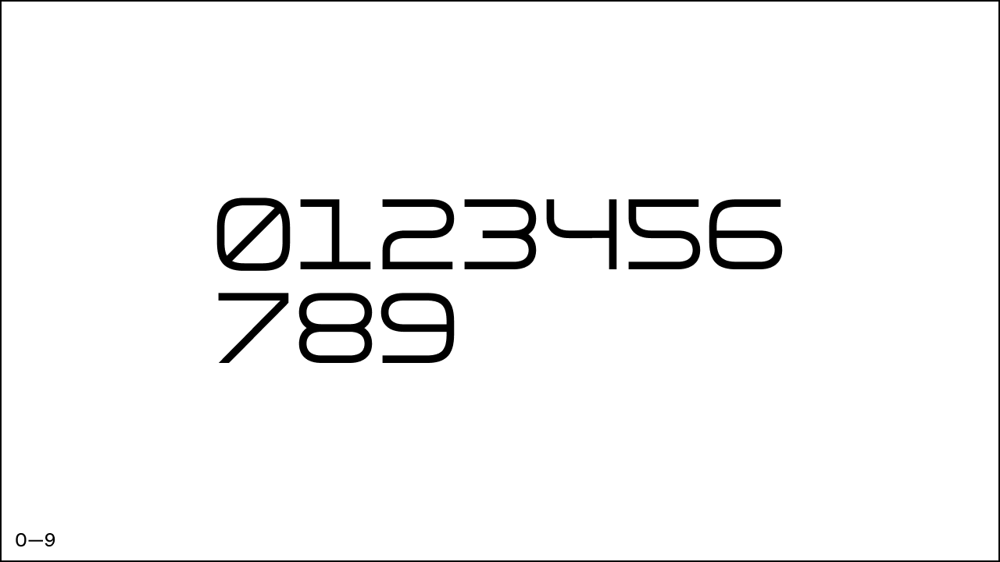

# ST-Type

The typography of arcade games was largely defined by the limitations of its medium — characters had to be designed to fit within an 8x8 pixel grid. The result, as games themselves, combined both functionality and simplicity, as well as playfulness.

ST-01 and ST-02 were inspired by the aesthetics of the arcade game typography implemented in high resolution for modern use.

> Please read the linked [EULA](/EULA.pdf) (End User License Agreement) carefully before purchasing, installing, or using the ST-01 font. By purchasing, installing, or using the ST-01 font, you are agreeing to be bound by the terms of this EULA.

# ST-01

# ST-02

